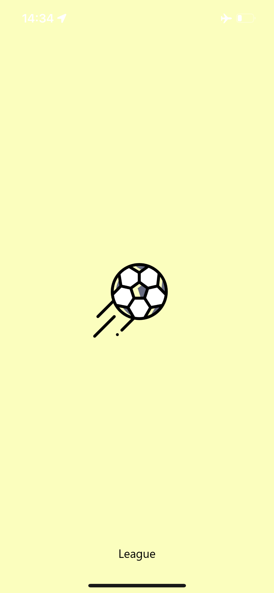
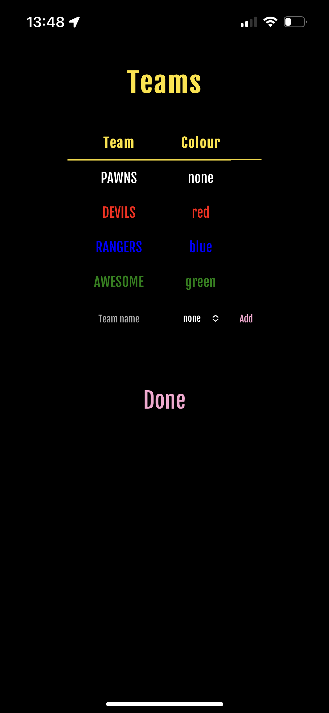
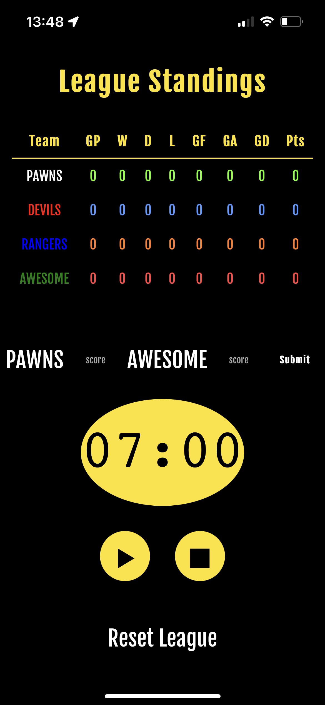
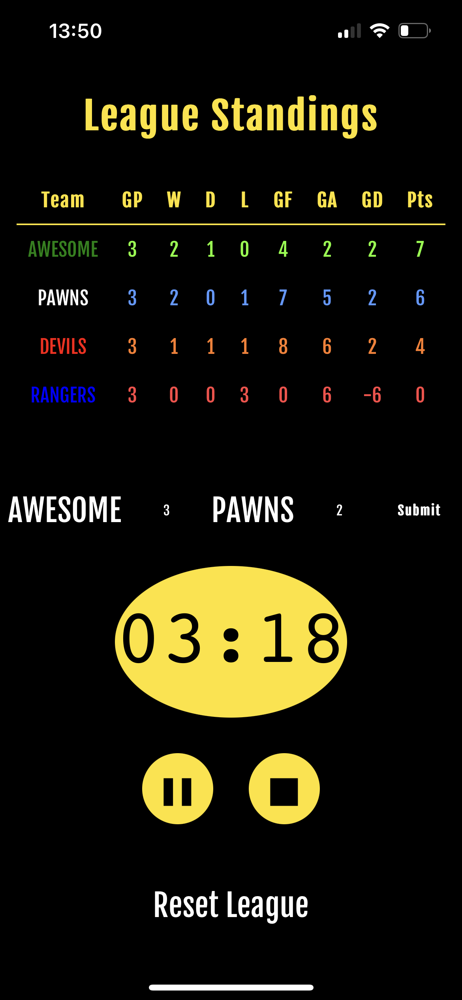
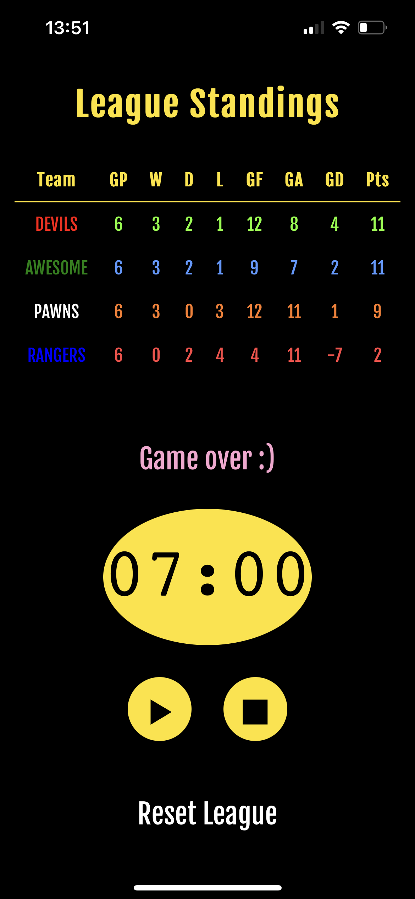

# [League](https://play.wftc.xyz/league)

Football league fixtures generator and timer.

Version: `2023-02-21`

## Purpose

Learn about progressive web apps (PWA) while bringing something useful to the world.

This app has been used during my weekly ⚽ matches in university. People seem to like the simplicity of the interface, the fact that it doesn't need to be installed through an app store, that it works offline, and of course... that it's free 😅

## Screenshots

## Future development

As Android paces ahead and paves the future of modern web development, the recent release of iOS 16.4 has inched Apple phones and tablets a bit closer to the competition. Many of the features that make PWAs a great alternative to native apps, such as enabling an installation prompt and background app refresh and notifications, are simply missing from iOS.

More can be learned about PWA from this fantabulous resource that Google developed: [https://web.dev/learn/pwa](https://web.dev/learn/pwa)

As these features slowly but steadily roll out, expect for this repository to be updated with additions and improvements to the already working and stable app.
